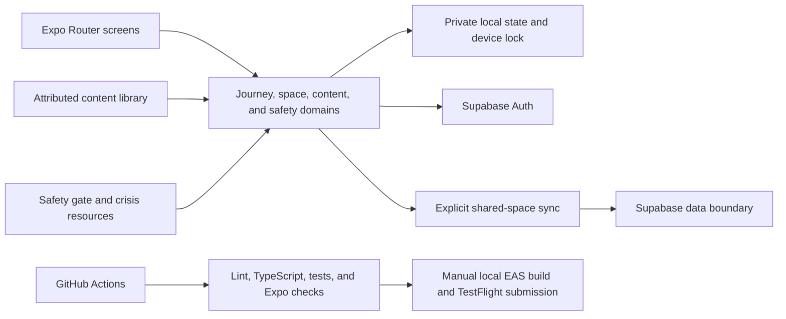

# Mend

<p align="center">
  
</p>

<p align="center"><strong>A free, private app for two people who want to understand each other better, grow closer, and stay in sync.</strong></p>

<p align="center">
  <a href="#product">Product</a> |
  <a href="#architecture">Architecture</a> |
  <a href="#development">Development</a> |
  <a href="SECURITY.md">Security</a>
</p>

Mend guides two people through a staged journey of attention, curiosity, communication, trust, and shared direction. It supports everyday relationship growth as well as repair when things feel difficult. Its exercises draw from attributed relationship frameworks including Gottman, EFT, PREP, and NVC. Mend does not diagnose, replace professional care, or invent clinical guidance.

**Stack:** Expo 57, React Native, TypeScript, Expo Router, Supabase, AsyncStorage, i18next, EAS local builds, and GitHub Actions.

## Product

- **The Journey:** a five-chapter path with shared steps, visible progress, pulse movement, and earned milestones
- **Shared Space:** a private place for answers, notes, plans, appreciation, and progress
- **Connection tools:** guided conversations, games, card decks, pulse checks, and challenges
- **Focused support:** optional tracks for conflict, trust, intimacy, major changes, and other specific seasons
- **Safety routing:** crisis and professional-help resources remain reachable without a paywall
- **Privacy:** optional device lock, private local records, explicit account controls, and no advertising
- **Independence:** Mend builds repeatable skills without streak pressure or dependence on the app

The complete product contract is in [SPEC.md](SPEC.md). Research, safety, honesty, inclusivity, and content-review artifacts live under [`docs/`](docs/).

## Architecture



Safety content and routing are product-critical code. Changes to crisis resources, coercion boundaries, professional-help language, or content attribution require focused review and tests.

## Repository map

| Path | Purpose |
| --- | --- |
| `src/app` | Expo Router screens and navigation |
| `src/lib` | Auth, privacy, sync, progression, safety, and content domains |
| `src/components` | Shared product UI |
| `src/locales` | Maintained translations |
| `docs/research` | Source material and decision records |
| `docs/review` | Safety, inclusivity, honesty, and contract audits |
| `.github/workflows` | Continuous verification and manual TestFlight delivery |

## Development

Requirements: Node.js 22 and npm.

```sh
npm ci
npm run start
```

Verification:

```sh
npm run lint
npm run typecheck
npm test
```

Useful platform commands:

```sh
npm run ios
npm run android
npm run web
```

Do not commit private credentials. Supabase's publishable client key is not a server secret; privileged operations must remain behind protected server boundaries.

## Delivery

Pull requests run lint, TypeScript, tests, and Expo configuration validation. `.github/workflows/testflight.yml` is manual-only and performs a local EAS iOS build before submitting the resulting artifact to TestFlight.

## Status

Mend is in TestFlight release development. Public claims should stay aligned with the tested build and the evidence in this repository.

## Contributing, security, and license

Read [CONTRIBUTING.md](CONTRIBUTING.md) before proposing a change. Report vulnerabilities privately using [SECURITY.md](SECURITY.md). Mend is available under the MIT License; see [LICENSE](LICENSE).
