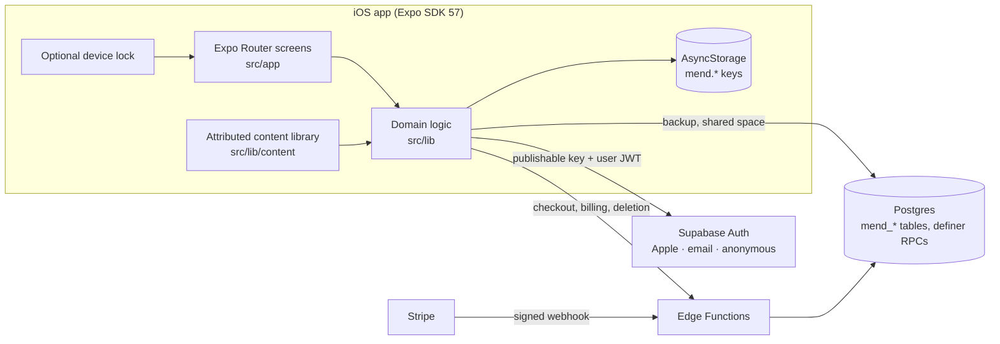

<p align="center">
  
</p>

<h1 align="center">Mend</h1>

<p align="center"><strong>A private iOS app that helps two people connect, grow, and stay in sync.</strong></p>

<p align="center">
  
  
  
  
  <a href="LICENSE"></a>
</p>

<p align="center">
  <a href="#privacy-model">Privacy model</a> ·
  <a href="#architecture">Architecture</a> ·
  <a href="#run-it-locally">Run it locally</a> ·
  <a href="#quality-gates">Quality gates</a> ·
  <a href="SECURITY.md">Security</a>
</p>

Mend is for couples, whether dating, married, co-parenting, or unlabeled, who want a structured
practice they do together: people who are doing fine and want to understand each other better, and
people working through a hard season. Partners move through a five-chapter journey of guided
conversations, games, card decks, pulse checks, and challenges drawn from attributed frameworks (the
Gottman Method, Emotionally Focused Therapy, PREP, and Nonviolent Communication). Mend is an educational
tool. It does not diagnose, and it points people to crisis lines and professional help rather than
standing in for them.

## Status

**Beta on iOS, distributed through TestFlight.** Mend is not on the App Store yet. The latest tagged
milestone is the [`v1.0.0-beta.1`](https://github.com/erickdronski/mend-app/releases/tag/v1.0.0-beta.1)
pre-release, and [CHANGELOG.md](CHANGELOG.md) tracks changes since. Android and web targets are
configured but not released.

## Features

- **The Journey.** Five chapters, from making room for each other to building what comes next. Steps
  complete from evidence the app can see where possible (finished sessions, both partners' quiz results,
  adopted rituals), and each chapter ends with a pulse check. From chapter two on, both partners answer.
- **Shared space.** Two phones join one room with an invite code. Both partners answer the same daily
  question, and the app shows a partner's answer only after you have sent your own. A shared notes board
  sits alongside.
- **Guided conversations and play.** Structured talk sessions, card decks, couple games, multi-day
  challenges, stories, and a technique toolkit. Focused-support tracks cover hard seasons such as an
  affair, grief, serious illness, money stress, or a new baby, and differences such as neurodivergence
  or culture.
- **Safety first.** During onboarding Mend asks directly whether either person is afraid of the other,
  and an "I'm not sure" answer goes straight to help. The crisis-resources screen is reachable in every
  account and onboarding state, and a low pulse score shows professional-help options privately, on
  that person's own turn, before the phone is handed on.
- **No streak pressure.** Progress counts practiced days, not consecutive ones, and activity in future
  chapters cannot inflate the progress percentage. Both rules are covered by tests.
- **Localized interface.** English, Spanish, French, German, and Portuguese. Long-form guides and decks
  are English-only for now, and the app says so.
- **Mend Plus.** The first journey chapter, starter decks and games, the shared space, and all safety
  resources are included without paying. A Plus plan unlocks the remaining chapters and full content for
  both partners in a room. App Store purchasing is not enabled yet, so iOS builds have no purchase path
  today.

## Privacy model

Mend holds some of the most sensitive things people write down. This section describes what the code in
this repository does.

**On the device**

- Everything starts local. Profile, journey progress, session reflections, plans, pulse scores, and
  quiz results are stored in AsyncStorage under `mend.*` keys ([`src/lib/store.ts`](src/lib/store.ts)).
  The app keeps working offline, and creating the background account never blocks the UI.
- An optional **app lock** ([`src/lib/lock.ts`](src/lib/lock.ts)) covers the app with a Face ID, Touch ID,
  or device-passcode prompt at launch and whenever it returns from the background. It is an access gate;
  the app does not add its own encryption to local data.

**Accounts**

- People can continue with Apple, use email and password, or skip sign-in. When someone skips, Mend
  creates an anonymous Supabase account in the background, with no email or password, so backup and the
  shared space can work ([`src/lib/auth.tsx`](src/lib/auth.tsx)).

**What leaves the device**

- **Backup.** Whenever a Supabase session exists, including the anonymous one, the app copies its local
  state into the user's row in `mend_state` (at most once a minute) and the two partner names into
  `mend_profiles`, so a reinstall or new phone can restore progress ([`src/lib/sync.ts`](src/lib/sync.ts)).
  That snapshot includes free-text session reflections and pulse scores. Settings describes this backup.
- **Shared space.** Display names, daily answers, and notes are stored in Supabase so both phones can
  see them. The app reads today's answers through the `mend_daily_reveal` RPC, which returns a partner's
  answer only after you have answered. Pulse scores and quiz results are not written to shared-space
  tables.
- **Nothing else.** The app has no analytics, crash-reporting, or advertising SDKs in its dependencies.
  Network requests go to Supabase, to Apple when Sign in with Apple is used, and to web pages the user
  chooses to open.
- Data is encrypted in transit (TLS) and stored by Supabase. It is **not** end-to-end encrypted.

**Server-side boundaries**

- The only key the client ships is the Supabase publishable key, which is designed to be public
  ([`src/lib/supabase.ts`](src/lib/supabase.ts)). Server secrets (the service-role key and Stripe keys) are
  read only from Edge Function environment variables.
- The Postgres `anon` role has no privileges on Mend's tables or RPCs. Signed-in users get narrow grants:
  rooms and memberships are read-only and change only through `SECURITY DEFINER` RPCs with a pinned
  `search_path`, entitlements are readable only through `mend_my_access()`, and a unique constraint on
  room and role holds the two-person limit under concurrent joins
  ([`supabase/migrations`](supabase/migrations)).
- Paid access is written only by the Stripe webhook after signature verification, with idempotent event
  tracking. The client has no write grant on entitlements, and
  [`tests/monetization-contract.test.ts`](tests/monetization-contract.test.ts) guards that boundary.
- `supabase/migrations` starts from an existing schema: it records the grant, constraint, and billing
  changes applied since, not the original table and policy definitions.

**Deletion**

- Settings → *Delete my account and data* calls the `mend-delete-account` Edge Function and then removes
  every `mend.*` key from the device.

## Architecture


```mermaid
flowchart LR
    subgraph Device["iOS app (Expo SDK 57)"]
        Lock["Optional device lock"] --> Router["Expo Router screens<br/>src/app"]
        Router --> Domain["Domain logic<br/>src/lib"]
        Content["Attributed content library<br/>src/lib/content"] --> Domain
        Domain --> Local[("AsyncStorage<br/>mend.* keys")]
    end
    Domain -- "publishable key + user JWT" --> Auth["Supabase Auth<br/>Apple · email · anonymous"]
    Domain -- "backup, shared space" --> DB[("Postgres<br/>mend_* tables, definer RPCs")]
    Domain -- "checkout, billing, deletion" --> Fn["Edge Functions"]
    Stripe["Stripe"] -- "signed webhook" --> Fn
    Fn --> DB
```

**App.** Expo SDK 57, React Native 0.86, React 19.2 with the React Compiler, TypeScript, Expo Router with
typed routes, Reanimated 4, and i18next. [`src/app/_layout.tsx`](src/app/_layout.tsx) gates navigation in
a fixed order: device lock, then sign-in or onboarding (which holds the safety question), then the four
tabs (Home, Journey, Talk, Explore). `/safety` stays reachable from every state.

**Backend.** One Supabase project.

| Piece | What it is |
| --- | --- |
| Tables | `mend_state`, `mend_profiles`, `mend_spaces`, `mend_space_members`, `mend_daily_answers`, `mend_notes`, `mend_entitlements`, `mend_billing_events` |
| Client RPCs | `mend_create_space`, `mend_join_space`, `mend_leave_space`, `mend_daily_reveal`, `mend_space_progress`, `mend_my_access` |
| Edge Functions | [`mend-checkout`](supabase/functions/mend-checkout/index.ts), [`mend-billing-portal`](supabase/functions/mend-billing-portal/index.ts), [`mend-stripe-webhook`](supabase/functions/mend-stripe-webhook/index.ts), and `mend-delete-account` (deployed; its source is not yet in this repository) |
| Contract check | [`scripts/check-backend-contract.mjs`](scripts/check-backend-contract.mjs) fails the build if the app uses a table, RPC, or function that is not on the reviewed list, or if the list goes stale |

**Repository map**

| Path | Purpose |
| --- | --- |
| `src/app` | Expo Router screens: tabs, onboarding, shared space, journey tools, settings, safety |
| `src/lib` | Auth, local store, backup, shared space, journey and momentum logic, entitlements, device lock |
| `src/lib/content` | Tracks, decks, games, challenges, daily questions, and safety resources, with sources |
| `src/locales` | Interface translations |
| `supabase/` | Migrations, Edge Functions, and function config |
| `tests/` | Vitest suites for journey math, momentum, recommendations, safety resources, and product contracts |
| `docs/research`, `docs/review` | Framework sources, plus safety, honesty, inclusivity, and contract reviews |
| `content/`, `social/` | Reviewed insight notes and the generator for their social posts |

The product specification is in [SPEC.md](SPEC.md).

## Run it locally

Requirements: Node.js 22.12+ or 24 (CI uses 22), npm, and Xcode for the iOS Simulator.

```sh
npm ci
npm run ios     # build a development build and launch it in the iOS Simulator
npm start       # start Metro for a development build that is already installed
npm run web     # run the web target in a browser
```

The app talks to the project's Supabase instance by default. To use your own, set
`EXPO_PUBLIC_SUPABASE_URL` and `EXPO_PUBLIC_SUPABASE_KEY` (a publishable key). Never put a service-role
key in an `EXPO_PUBLIC_*` variable; those values are bundled into the app.

## Quality gates

`npm run verify` is the single gate, and the Verify workflow runs exactly that command.

| Step | Command | Checks |
| --- | --- | --- |
| Lint | `npm run lint` | ESLint with `eslint-config-expo` |
| Types | `npm run typecheck` | `tsc --noEmit` |
| Tests | `npm test` | Vitest: journey progress, momentum, recommendations, crisis routes and the coercive-control boundary, monetization and positioning contracts |
| Content | `npm run content:check` | Insight notes load and validate |
| Backend contract | `npm run backend:contract` | App references match the reviewed Supabase surface |
| Expo | `npm run expo:check` | Installed packages match Expo SDK 57 and the app config resolves |

`npm run backend:smoke` is an end-to-end check against a live Supabase project: three anonymous users,
room creation, a race between two joiners where exactly one may win, sealed then revealed daily answers,
shared notes, and account cleanup. It needs the two `EXPO_PUBLIC_SUPABASE_*` variables.

## CI and release

- **Verify** ([`verify.yml`](.github/workflows/verify.yml)) triggers on pull requests and pushes to
  `main`, and runs `npm ci` and `npm run verify` on Node 22. Its `verify` job is the required status
  check for `main`. Third-party actions are pinned to commit SHAs and the token is read-only.
- **TestFlight** ([`testflight.yml`](.github/workflows/testflight.yml)) has no automatic trigger; it runs
  only on manual dispatch, behind the `testflight` environment. It builds with `eas build --local` and
  submits with an App Store Connect API key held in repository secrets. The same build can be produced
  locally on a Mac.
- **Supply chain.** Dependabot is configured for weekly npm and GitHub Actions updates, with
  SDK-managed packages left to `npx expo install --fix`. Secret scanning with push protection is
  enabled.

## Contributing, security, and license

Read [CONTRIBUTING.md](CONTRIBUTING.md) before proposing a change. Changes that touch crisis resources,
coercion boundaries, professional-help language, or content attribution need focused review and tests.
Report vulnerabilities privately through [SECURITY.md](SECURITY.md), and never put relationship data in a
public issue. Mend is released under the [MIT License](LICENSE).
